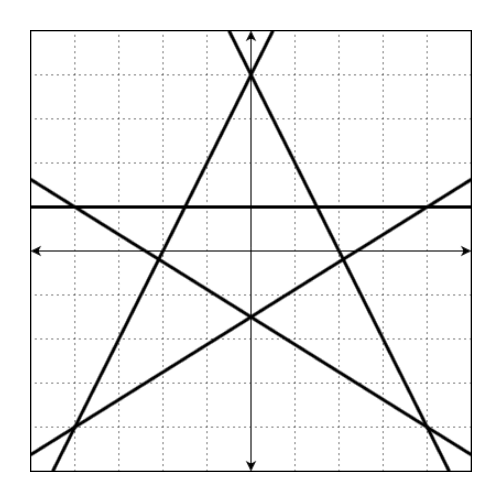
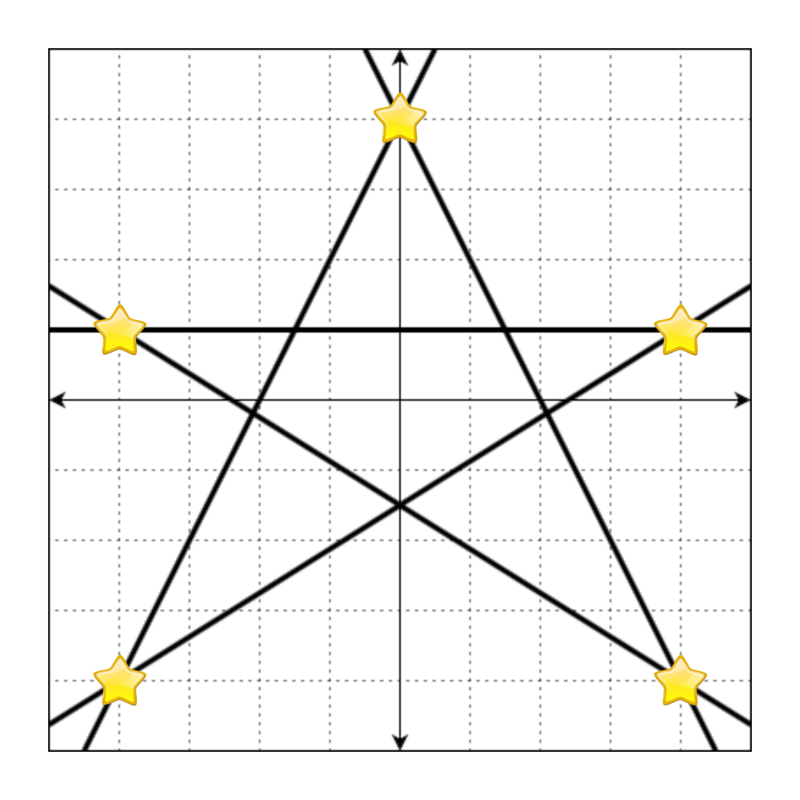
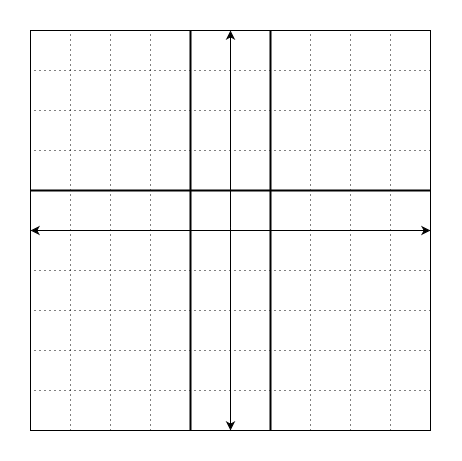
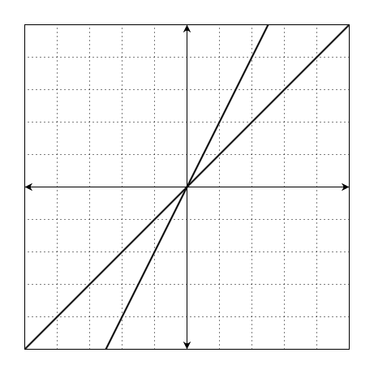
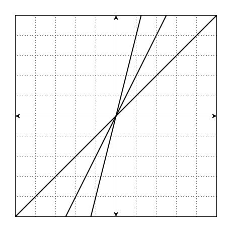

## 문제 설명
[프로그래머스 87377번 교점에 별 만들기](https://school.programmers.co.kr/learn/courses/30/lessons/87377)

`Ax + By + C = 0`으로 표현할 수 있는 `n`개의 직선이 주어질 때, 이 직선의 교점 중 정수 좌표에 별을 그리려 합니다.
예를 들어, 다음과 같은 직선 5개를

* `2x - y + 4 = 0`
* `-2x - y + 4 = 0`
* `-y + 1 = 0`
* `5x - 8y - 12 = 0`
* `5x + 8y + 12 = 0`

좌표 평면 위에 그리면 아래 그림과 같습니다.



이때, 모든 교점의 좌표는 `(4, 1)`, `(4, -4)`, `(-4, -4)`, `(-4, 1)`, `(0, 4)`, `(1.5, 1.0)`, `(2.1, -0.19)`, `(0, -1.5)`, `(-2.1, -0.19)`, `(-1.5, 1.0)`입니다. 이 중 정수로만 표현되는 좌표는 `(4, 1)`, `(4, -4)`, `(-4, -4)`, `(-4, 1)`, `(0, 4)`입니다.

만약 정수로 표현되는 교점에 별을 그리면 다음과 같습니다.



위의 그림을 문자열로 나타낼 때, 별이 그려진 부분은 `*`, 빈 공간(격자선이 교차하는 지점)은 `.`으로 표현하면 다음과 같습니다.

```plaintext
"..........."  
".....*....."  
"..........."  
"..........."  
".*.......*."  
"..........."  
"..........."  
"..........."  
"..........."  
".*.......*."  
"..........."  
```

이때 격자판은 무한히 넓으니 모든 별을 포함하는 최소한의 크기만 나타내면 됩니다.

따라서 정답은

```plaintext
"....*...."  
"........."  
"........."  
"*.......*"  
"........."  
"........."  
"........."  
"........."  
"*.......*"  
```

입니다.

직선 `A, B, C`에 대한 정보가 담긴 배열 `line`이 매개변수로 주어집니다. 이때 모든 별을 포함하는 최소 사각형을 return 하도록 solution 함수를 완성해주세요.

## 제한 사항

* line의 세로(행) 길이는 2 이상 1,000 이하인 자연수입니다.
  * line의 가로(열) 길이는 3입니다.
  * line의 각 원소는 \[A, B, C\] 형태입니다.
  * A, B, C는 -100,000 이상 100,000 이하인 정수입니다.
  * 무수히 많은 교점이 생기는 직선 쌍은 주어지지 않습니다.
  * A = 0이면서 B = 0인 경우는 주어지지 않습니다.
* 정답은 1,000 * 1,000 크기 이내에서 표현됩니다.
* 별이 한 개 이상 그려지는 입력만 주어집니다.

## 입출력 예시

|                                  num_list                                   |                                                            result                                                            |
|:---------------------------------------------------------------------------:|:----------------------------------------------------------------------------------------------------------------------------:|
| \[\[2, -1, 4\], \[-2, -1, 4\], \[0, -1, 1\], \[5, -8, -12\], \[5, 8, 12\]\] | \["....\*....", ".........", ".........", "\*.......\*", ".........", ".........", ".........", ".........", "\*.......\*"\] |
|                 \[\[0, 1, -1\], \[1, 0, -1\], \[1, 0, 1\]\]                 |                                                         \["\*.\*"\]                                                          |
|                       \[\[1, -1, 0\], \[2, -1, 0\]\]                        |                                                           \["*"\]                                                            |
|                \[\[1, -1, 0\], \[2, -1, 0\], \[4, -1, 0\]\]                 |                                                           \["*"\]                                                            |


### 입출력 예 설명 1

문제 예시와 같습니다.

### 입출력 예 설명 2

직선 `y = 1`, `x = 1`, `x = -1`는 다음과 같습니다.



`(-1, 1)`, `(1, 1)` 에서 교점이 발생합니다.

따라서 정답은

```plaintext
"*.*"  
```

입니다.

### 입출력 예 설명 3

직선 `y = x`, `y = 2x`는 다음과 같습니다.



`(0, 0)` 에서 교점이 발생합니다.

따라서 정답은

```plaintext
"*"
```

입니다.

### 입출력 예 설명 4

직선 `y = x`, `y = 2x`, `y = 4x`는 다음과 같습니다.



`(0, 0)` 에서 교점이 발생합니다.

따라서 정답은

```plaintext
"*"
```

입니다.

## 참고 사항

`Ax + By + E = 0`<br/>
`Cx + Dy + F = 0`<br/>
두 직선의 교점이 유일하게 존재할 경우, 그 교점은 다음과 같습니다.

$x=\frac{BF - ED}{AD - BC}$
$y=\frac{EC - AF}{AD - BC}$

또, AD - BC = 0인 경우 두 직선은 평행 또는 일치합니다.

## 코드 구현

### Python

```python
from itertools import combinations

def solution(num_list):
    dots = [
        [
            int(get_x(a=selected_nums[0][0], b=selected_nums[0][1], c=selected_nums[1][0], d=selected_nums[1][1], e=selected_nums[0][2], f=selected_nums[1][2])),
            int(get_y(a=selected_nums[0][0], b=selected_nums[0][1], c=selected_nums[1][0], d=selected_nums[1][1], e=selected_nums[0][2], f=selected_nums[1][2]))
        ]
        for selected_nums in list(combinations(num_list, 2))
            if get_x(a=selected_nums[0][0], b=selected_nums[0][1], c=selected_nums[1][0], d=selected_nums[1][1], e=selected_nums[0][2], f=selected_nums[1][2]).is_integer()
            if get_y(a=selected_nums[0][0], b=selected_nums[0][1], c=selected_nums[1][0], d=selected_nums[1][1], e=selected_nums[0][2], f=selected_nums[1][2]).is_integer()
    ]

    dots_x = [dot[0] for dot in dots]
    dots_y = [dot[1] for dot in dots]

    min_x = min(dots_x)
    max_x = max(dots_x)
    min_y = min(dots_y)
    max_y = max(dots_y)

    answer = []

    for y in range(max_y, min_y - 1, -1):
        line_x = ""
        for x in range(min_x, max_x + 1):
            if [x, y] in dots:
                line_x = "".join([line_x, "*"])
            else:
                line_x = "".join([line_x, "."])

        answer.append(line_x)

    return answer


def get_x(a, b, c, d, e, f) -> float:
    if (a * d - b * c) == 0:
        return float('inf')
    return (b * f - e * d) / (a * d - b * c)

def get_y(a, b, c, d, e, f) -> float:
    if (a * d - b * c) == 0:
        return float('inf')
    return (e * c - a * f) / (a * d - b * c)
```

### 시간 복잡도 - Python

* 교점을 찾는 부분에서 조합을 생성할 때의 시간 복잡도는 $O(n^2)$, 교점을 계산할 때의 시간 복잡도는 $O(1)$이다. 따라서, 시간 복잡도는 $O(n^2)$이다.
* 최대/최소 좌표를 찾는 부분에서 리스트 컴프리헨션을 이용하여 좌표를 분리하는 부분에서 시간 복잡도는 최대 $O(n^2)$이며, 최댓값, 최솟값을 찾는 부분에서 시간 복잡도는 $O(n^2)$이다.
* 별을 찍는 부분에서 이중 반복문의 최대 시간 복잡도는 각각 $O(n^2)$이며, 교점을 검색하는 데 필요한 시간 복잡도는 $O(n^2)$이다. 따러서, 별을 찍는 부분의 시간 복잡도는 최대 $O(n^6)$이다.
* 따라서, 시간 복잡도는 최대 $O(n^6)$이다.

### 개선할 점 - Python

* 교점을 찾을 때, 아래의 수정된 방법을 이용하면, 시간 복잡도, 공간 복잡도 측면에서 더 유리하다.
* 별을 찍을 때, 리스트대신 집합을 사용하면 더 빠르게 별을 찍어야 할 점인지 확인할 수 있다.
* 최소사각형의 범위를 구할 때, 리스트 컴프리헨션 대신에 제너레이터를 사용하면 공간 복잡도를 더 작게 할 수 있고 큰 데이터를 사용할 때, 더 빠른 속도를 낼 수 있다.
* 두 문자열을 결합할 때, `join()`을 사용하면 `+=`보다 시간 복잡도, 공간 복잡도 측면에서 더 유리하지만, 작은 수의 문자열을 결합할 때는 큰 차이가 없으며 가독성을 위해 `+=`를 사용하는 것이 좋다.

```python
from itertools import combinations

def solution(num_list):
    dots = []

    for (a, b, e), (c, d, f) in combinations(num_list, 2):
        x = get_x(a, b, c, d, e, f)
        y = get_y(a, b, c, d, e, f)

        if x.is_integer() and y.is_integer():
            dots.append((int(x), int(y)))

    min_x = min(dot[0] for dot in dots)
    max_x = max(dot[0] for dot in dots)
    min_y = min(dot[1] for dot in dots)
    max_y = max(dot[1] for dot in dots)

    answer = []

    dots_set = set(dots)

    for y in range(max_y, min_y - 1, -1):
        line_x = ""
        for x in range(min_x, max_x + 1):
            line_x += "*" if (x, y) in dots_set else "."
        answer.append(line_x)

    return answer


def get_x(a, b, c, d, e, f) -> float:
    if (a * d - b * c) == 0:
        return float('inf')
    return (b * f - e * d) / (a * d - b * c)

def get_y(a, b, c, d, e, f) -> float:
    if (a * d - b * c) == 0:
        return float('inf')
    return (e * c - a * f) / (a * d - b * c)
```